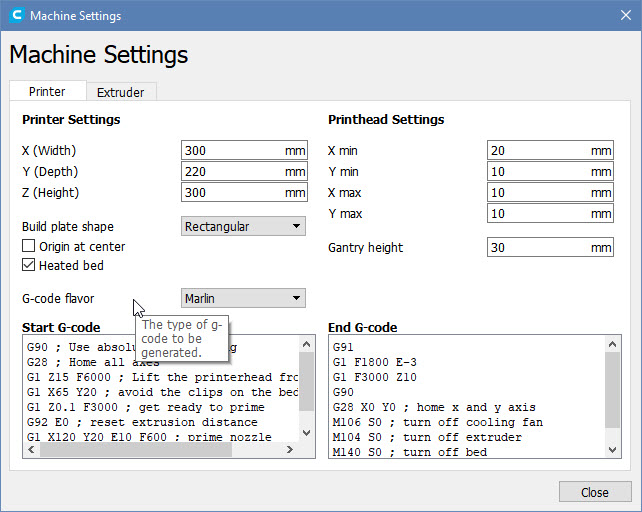

# General tips and tricks
In this guide you will find general tips and tricks for the CR-10 mini printer.

## Better start code
One of the problems that we encountered with our printer is that it oozes plastic
at the start of the print. Also, in between prints, some material will collect in the 
extruder head, which then causes plastic to ooze out when you start another print.

When we printed our second part, the oozing problem caused a defect in the print,
because a thick piece of plastic would get stuck in the first layer.

To prevent this from happening, we made a change in our slicer configuration. 

**Note:** Since we use Cura as our slicer, this guide will describe how to fix the 
oozing problem in the Cura printer settings. But you can use this code in any 
slicer.

In Cura, click on the name of your printer in the top-right of the screen 
and select `Manage printers`. Then edit the settings for your CR-10 mini printer.



In the start code section, enter the following code:

``` gcode
G90 ; Use absolute positioning
G28 ; Home all axes
G1 Z15 F6000 ; Lift the printerhead from the bed
G1 X65 Y20 ; avoid the clips on the bed
G1 Z0.1 F3000 ; get ready to prime
G92 E0 ; reset extrusion distance
G1 X120 Y20 E10 F600 ; prime nozzle
G1 X150 Y20 F5000 ; quick wipe
```

This gcode fragment, lifts the printerhead to 15mm above the printerbed.
It then moves the head to 65mm on the X-axis and 20mm on the Y-axis to avoid
the clips on the printerbed.

Then we start the priming process and ask the printer to extrude a little bit
of plastic on to the printerbed along X-axis. This will get rid of the cruft
that is built-up in the printhead. 

Finally we do a quick wipe to get rid of the rest of the plastic.

Using this code we solved our oozing problem.